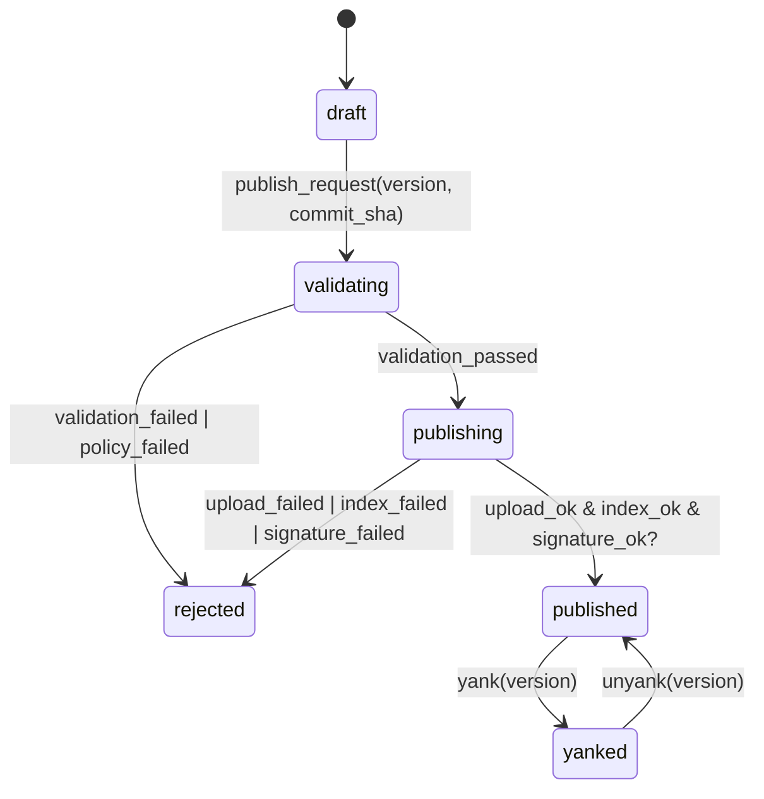

# Publish Flow State Machine

States:
- draft
- validating
- publishing
- published
- rejected
- yanked

Invariants:
- version immutable once published
- version maps to exactly one commit sha
- published implies tarball+sha256 retrievable
- yanked remains resolvable via exact version pin
